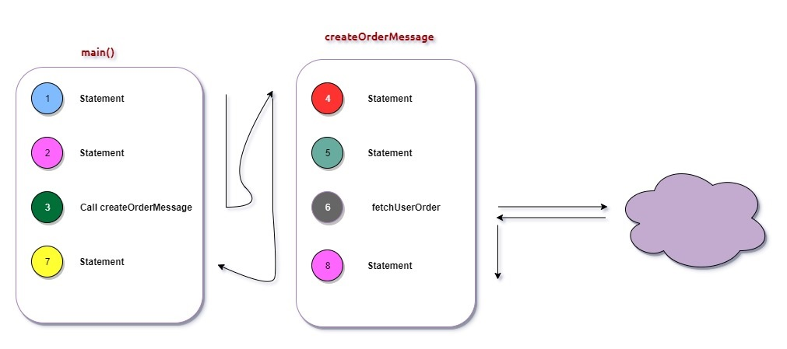
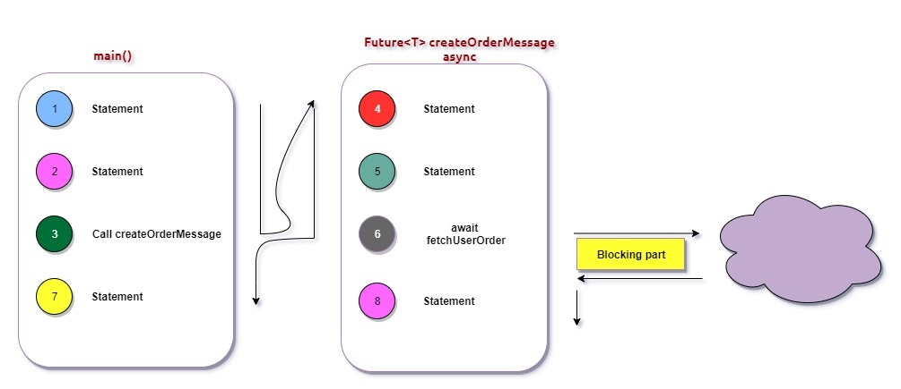

# Asynchronous calls in Dart

Id: 22-asynchronous-calls-in-dart
Author: ryandam
Summary: This post talks about Asynchronous calls in Dart.
Categories: Dart, Flutter, Asynchronous calls
Status: Draft
Feedback Link: ryandam.9@gmail.com

## Overview

Let's take a scenario - We are building a mobile application to show current temperatures of different cities. To get current weather info, we may need to call multiple endpoints that provide the required info in JSON format. To achieve this, we may create a function `_getTemperature` that takes a city as an argument, calls the endpoint, and returns the result as a Map. 

When calling a service over the wire, we never know about the elapsed time. If the service is going to taking time, our function is blocked until the result arrives! It may impact the entire application. This is *a Synchronous call.*

However, In our weather example, we don't have to wait for the function to return. While the first call is waiting for the network API to return, we can invoke the function with different input. This is *an Asynchronous call.*

Dart provides support for Asynchronous calls using ***async, await, Future*** 

## Synchronous calls



- When using Synchronous function calls, the *Caller* needs to wait until all the statements in the function are executed. 
- If the function makes calls to remote services, the function's execution is blocked until the remote API returns.

```dart
import 'dart:io';

void createOrderMessage() {
  print('Statement 4');
  print('Statement 5');

  fetchUserOrder();

  print('Statement 8');
}

void fetchUserOrder() {
  sleep(Duration(seconds: 2));
  print('Long Operation');
}

void main() {
  print('Statement 1');
  print('Statement 2');
  createOrderMessage();
  print('Statement 7');
}
```

```
Statement 1
Statement 2
Statement 4
Statement 5
Long Operation
Statement 8
Statement 7
```

- *Statement 7* is executed only after all the statements in the function are executed.

## Asynchronous calls



- An `async` function runs synchronously until the first `await` keyword. This means that within an `async` function body, all synchronous code before the first `await` keyword executes immediately.
- As soon as the first `await` keyword is encountered, control immediately returns to the caller, and the caller then resumes its execution. Basically, the calling function does not wait until all the statements in the function are executed.

```dart
Future<void> createOrderMessage() async {
  print('Statement 4');
  print('Statement 5');

  await fetchUserOrder();

  print('Statement 8');
}

Future<void> fetchUserOrder() async {
  Future.delayed(Duration(seconds: 2), () => print('Long Operations'));
}

void main() {
  print('Statement 1');
  print('Statement 2');
  createOrderMessage();
  print('Statement 7');
}
```

```dart
Statement 1
Statement 2
Statement 4
Statement 5
Statement 7
Statement 8
Long Operations
```

- Even though `createOrderMessage` is an `async` function, it executes the first two statements *synchronously* (All statements until the first await are executed like a normal function)
- `createOrderMessage` returns when it sees the first `await`.
- `Statement 7` is executed before `Statement 8`.

### What happens to the return value of the function?

- When an Asynchronous function returns, it may not have executed all the statements in it. That means, the *return value* of the function is not known yet!. The function may not return a value, it may return an `int`, or a `String`. It may even fail while executing the rest of the statements. *How does the caller find out the return value of the function ?*
- This is when *Future* comes into the picture
- Think of a *future* as a box wrapping the return value of the **`async`** function. We don't know what's inside it until the function's execution is completed.
- The caller can choose to wait for the future to be completed using **`await `** Then, the caller's execution is paused until the future is completed with a value or with an error.

****

## Sample Async call

```dart
  Future<Map> _getTemperature(String place) async {
    final server = '10.0.2.2';
    final url = 'http://$server:5000/temperature/$place';

    final response = await http.get(url);
    final payload = json.decode(response.body) as Map<String, dynamic>;
    return payload;
  }
```


****

## Reference

- https://dart.dev/codelabs/async-await

****

